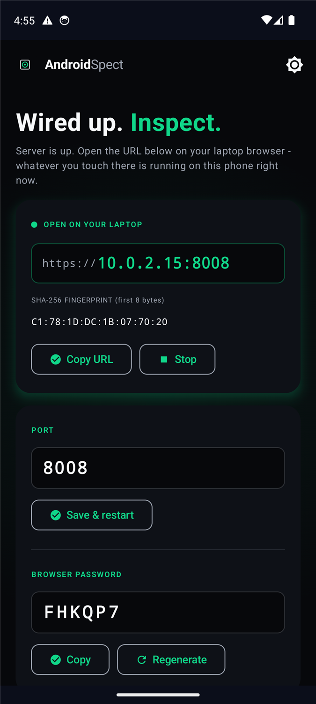
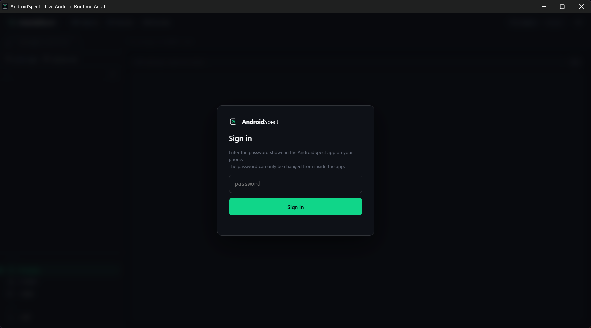
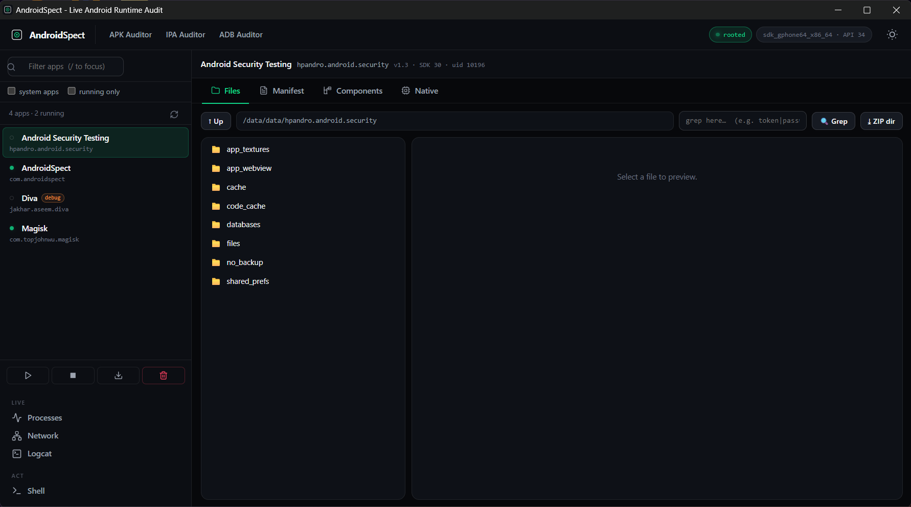
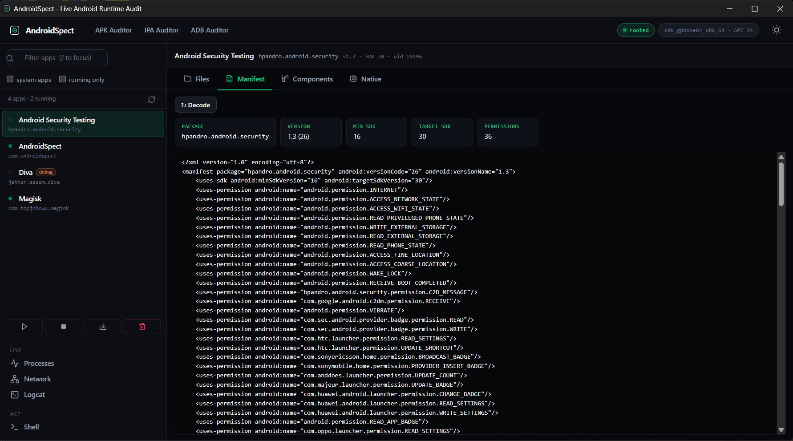
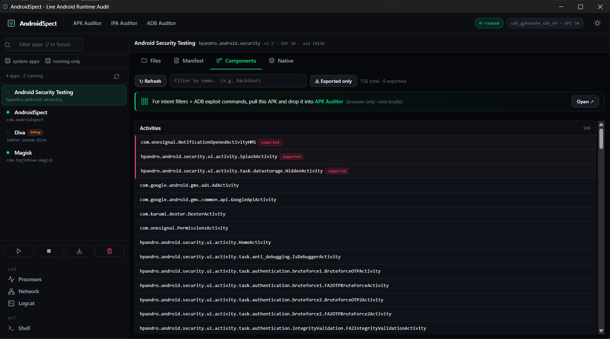
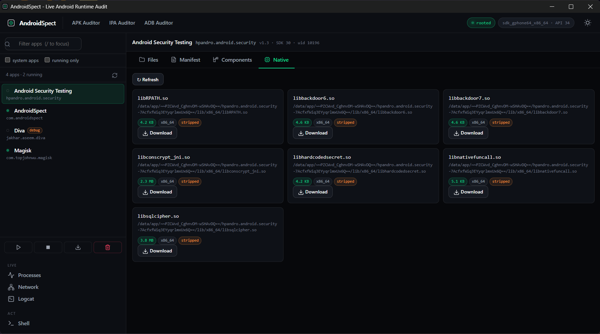
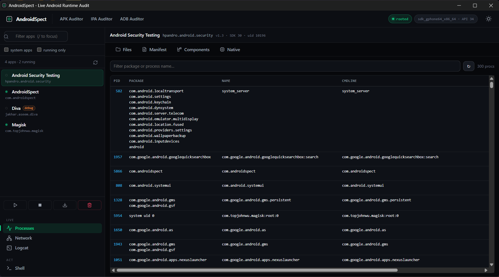
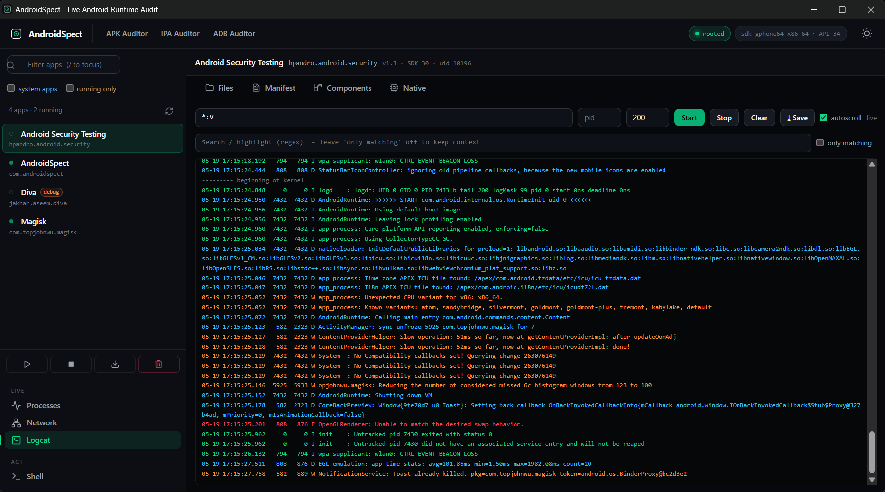

# AndroidSpect

Runtime audit tool for installed Android apps. Runs on a rooted phone, exposes an HTTPS dashboard from the device, and lets you browse any app's private storage from your laptop browser.

The dynamic-analysis sibling of:

* [apkauditor.com](https://apkauditor.com) for static APK analysis
* [ipaauditor.com](https://ipaauditor.com) for static IPA analysis
* [adbauditor.com](https://adbauditor.com) for live ADB audit over WebUSB

## What it does

Static inspection of any installed app on the device:

* File browser for `/data/data/<pkg>`, with type-aware previews for text, JSON, XML, images, and a hex view for everything else
* SQLite reader with tables, schema, paginated rows, ad-hoc SELECT, CSV export
* SharedPreferences viewer and inline editor
* Decoded `AndroidManifest.xml` with summary cards
* Components list (activities, services, receivers, providers) with the exported badge in red, name filter, exported-only toggle, sort exported-first
* Native libraries list per ABI with size and stripped-symbols flag, one-click `.so` download
* CTA into apkauditor.com for the heavy-weight component exploit research

Live runtime:

* Logcat tail over WebSocket with severity colouring, regex highlight, save-to-file
* Process snapshot from `/proc` with PID, PPID, UID, RSS, state, full cmdline
* TCP and UDP socket table from `/proc/net` decoded to `ip:port` with the owning package
* Root shell in the browser for one-shot `su` commands

App actions:

* Start, force-stop, clear data
* Pull every APK file that makes up a package (base plus splits) as a single ZIP

## Compatibility

| | |
| - | - |
| Minimum Android | 5.0 Lollipop (API 21) |
| Target Android | 16 (API 36) |
| Root | Magisk, KernelSU, APatch, or any `su` provider |
| Hooking framework | none. No Xposed, no LSPosed, no Zygisk. Pure root. |
| Build JDK | 17 |
| Gradle | 8.11.1 |
| AGP | 8.9.1 |

Core-library desugaring brings `java.time`, `java.util.function`, and `java.util.stream` to API 21 through 25, so Ktor 3 plus Netty work down to Lollipop.

## Quick install

1. Download `AndroidSpect-v0.1.0.apk` from the latest GitHub release.
2. Copy it to the phone and tap to install (enable "Install unknown apps" for the file manager you use).
3. Open AndroidSpect, tap **Start server**. Your root manager (Magisk / KernelSU) prompts for `su`. Grant it.
4. The phone screen now shows an `https://<phone-ip>:8008` URL, a SHA-256 fingerprint, and a six-character browser password.
5. Open that URL on your laptop browser.

If the phone and laptop are on the same Wi-Fi you can use the LAN IP directly.

The shipped APK is a debug build, signed with Android's standard debug key. That keeps install simple (no custom-keystore trust prompt) and the package id stays `com.androidspect` so it upgrades cleanly between versions.

## Compile from source

You need JDK 17 and the Android SDK with platforms 21 to 36 installed.

```
git clone <repo>
cd AndroidSpect
gradlew.bat :app:assembleDebug      # Windows
./gradlew :app:assembleDebug        # macOS / Linux
```

Output APK:

```
app/build/outputs/apk/debug/app-debug.apk
```

Or open the project root in Android Studio (Giraffe or newer) and use **Build > Build Bundle(s) / APK(s) > Build APK(s)**.

The project ships a single `debug` build variant signed with Android's standard debug key. If you want a minified, custom-signed release later, add a `release { ... }` block to `app/build.gradle.kts` with your own `signingConfig`.

## Using an emulator (AVD)

The browser dashboard binds `0.0.0.0:8008` on the phone. On a physical device on the same Wi-Fi that works directly. On an AVD you forward the port over ADB:

```
adb forward tcp:8008 tcp:8008
```

Then open `https://localhost:8008/` on your laptop. AVDs need root, so use a rooted system image (Magisk-on-AVD via rootAVD works on system image 34).

## Certificate warning on first browser visit

AndroidSpect serves its dashboard with a self-signed certificate generated on first run. The browser does not trust it. This is expected.

You will see an "insecure" or "not private" warning. The exact bypass depends on the browser:

**Chrome / Edge / Brave**
Click **Advanced**, then **Proceed to <ip> (unsafe)**. If the link does not appear, type `thisisunsafe` anywhere on the warning page (just type it, no input box needed) and the browser proceeds.

**Firefox**
Click **Advanced**, then **Accept the Risk and Continue**.

**Safari**
Click **Show Details**, then **visit this website**, confirm.

Before clicking through, compare the certificate fingerprint shown in the warning ("Subject" or "Details") against the SHA-256 fingerprint the AndroidSpect app displays on the phone screen. They must match. If they don't, something is on the network and you should not continue.

After the bypass, the browser asks for the six-character password shown in the app. Enter it. You're in.

## Screenshots

On-device dashboard. Start, stop, port, password, certificate fingerprint, status pill.



Browser login.



Target picker and Files tab on the selected app.



Decoded manifest with summary chips on top.



Components inspector with exported badge, filter, exported-only toggle, and the apkauditor.com CTA strip.



Native libraries per ABI with size and stripped flag, one-click `.so` download.



Process list from `/proc`.



Logcat live tail.



## Project layout

```
AndroidSpect/
  build.gradle.kts                        root Kotlin DSL build
  settings.gradle.kts
  gradle/libs.versions.toml               version catalog
  app/
    build.gradle.kts                      minSdk 21, targetSdk 36
    src/main/
      AndroidManifest.xml
      kotlin/com/androidspect/
        AndroidSpectApp.kt                Application, libsu shell builder
        MainActivity.kt                   Compose entry
        ui/                               Material 3 dashboard
        server/
          AndroidSpectServer.kt           Ktor wiring, TLS, WebSocket
          ServerService.kt                foreground service
          Security.kt                     password auth, session cookie, rate limit
          TlsManager.kt                   self-signed cert generation
          BootReceiver.kt
          routes/                         HTTP endpoints grouped by domain
          ws/LogcatBridge.kt              WebSocket for logcat tail
        root/                             privileged primitives, all via libsu
          RootBridge.kt                   single persistent su shell
          AppDataReader.kt                PackageManager + /data/data
          SqliteReader.kt                 staged copy then framework SQLite
          SharedPrefsParser.kt
          LogcatStreamer.kt
          ProcessReader.kt
          NetReader.kt                    /proc/net parser
          AppActions.kt                   am / pm wrappers
          ManifestDecoder.kt
          ComponentInspector.kt
          NativeLibScanner.kt
          Sanitize.kt
        data/AppInfo.kt
      assets/web/                         embedded UI served by Ktor
        index.html
        app.css
        app.js
        icon.svg
      res/                                icons, strings, themes
  screenshots/                            images for this README
  README.md
```

## Security model

* Password is set on first run and shown only in the on-device app. Browser sign-in uses a session cookie (HttpOnly, Secure, SameSite=Strict).
* Failed sign-ins are rate-limited per IP with exponential backoff and lockout.
* HTTPS only. The server generates a self-signed certificate the first time it starts. Its SHA-256 fingerprint is shown on the phone so you can verify the one your browser sees.
* `Host` header is restricted to `localhost`, `127.0.0.1`, and the current LAN IPv4 of the device. DNS-rebinding requests are rejected.
* All write operations (clear data, force-stop, prefs write, exec) are POST.
* The on-phone `su` grant is required. Without it the server starts but every privileged primitive returns an error.
* No analytics, no crash reporters, no auto-update, no outbound network calls of any kind.

## Stack

* Kotlin 2.1, Jetpack Compose, Material 3 for the on-device UI
* Ktor 3 (Netty, WebSockets, ContentNegotiation, kotlinx.serialization) for the embedded server
* libsu 6 for every privileged operation, single persistent shell, no per-call elevation
* BouncyCastle (`bcpkix-jdk18on`) for self-signed certificate generation
* AndroidX MultiDex plus `desugar_jdk_libs` 2.1.4 for API 21-25 compatibility

## Notes on design

* One `su` shell, always. `RootBridge` owns it. Every privileged primitive (file read, `/proc` parse, `am`, `pm`, `openssl`, `dd`) goes through it. Restarting the app reuses the shell as long as Magisk has not revoked the grant.
* The framework `SQLiteDatabase` cannot open a libsu-backed stream. The reader copies the target DB into the app cache (root readable, then world readable for our own UID) and opens it `OPEN_READONLY`. The original is never touched.
* The Compose UI is a launcher. The real product is the browser dashboard. The foreground service keeps the server alive across task removal.
* The Components tab links out to apkauditor.com instead of duplicating the heavy ADB exploit-helper work. That stays a browser-first tool.

## License

Not yet decided. Until then, all rights reserved.

Author: Sandeep Wawdane.
